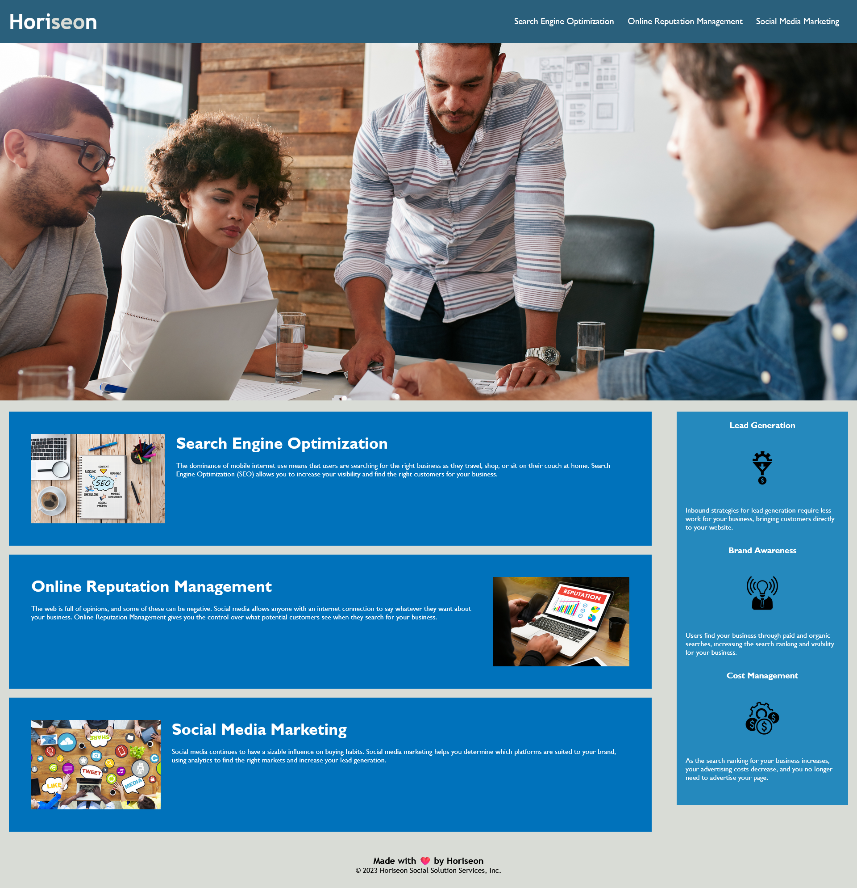

# 01 HTML CSS Git: Code Refactor

## Your Task

### Re-submission

Here's the updated web page - https://stephdavid.github.io/horiseon/

**HTML changes:**

* I added the viewport meta tag. Strange that I didn’t spot that it hadn’t been specified before. The W3C validator didn’t pick it up. But ESLint in Visual Studio Code and CSS HTML Validator software complained and highlighted it as an error. The viewport property tells browsers how to adjust the page's dimensions and scaling for the screen size. Google considers this a mobile usability error.

* Considered but not included, is The HTTP X-UA-Compatible header, which is still found in html documents, and used to provide special instruction to the Internet Explorer browser family concerning which document type to use. As Internet Explorer was replaced by Microsoft Edge and Microsoft no longer supports Internet Explorer, this HTTP header is no longer needed.- See https://http.dev/x-ua-compatible

* The Hero banner is a web design term that I not heard of before this bootcamp. The hero banner area is the area of the page between the navigation and the start of your content. The hero banner is often an image, but it doesn't have to be. It serves as the starting point for your page and its contents should orient the user to the content on the rest of the page.  https://www.usu.edu/template/guide/structure/banners.cfm 

* I am always happy to replace div tags with more semantic ones, in this case: nav and some sections.

**CSS changes:**

* I made benefit-cost a class by adding a period in front. You have to trust me on this one😊 - it was combined with other classes as I explain below.

* In the CSS main section styles I combined the classes: search engine optimization, online-reputation-management, and social media marketing to become the service class. In the aside styles I combined the classes: lead-generation, brand-awareness, and cost management classes to become benefits. 

* I added comments for the header, navigation, hero banner, main, aside and footer. I reorganised the style blocks to their geographical top/down locations.

---

Refactor an existing site to make it more accessible.

- https://stephdavid.github.io/horiseon/

- spell check

- fix incorrect inner link - in this case, add an id

- validate the html via W3C validation service - https://validator.w3.org/ - revealed that all images required an alt tag.

- run an accessibility checker on the page - picked up no sections and a broken link

- css validation - https://jigsaw.w3.org/css-validator/ - passed

- added explanatory comments to the sections of the page

- n.b. the main image is embedded and therefore does not take an alt tag - the accessibility question on whether this or not is important
  
- optimized the css by grouping elements (tip from a classmate)

